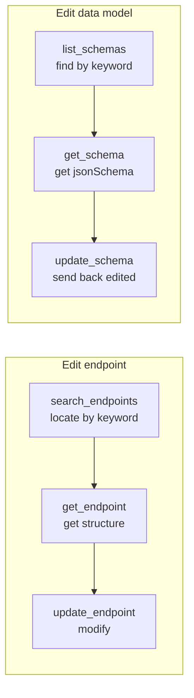

# Apifox MCP Server

[](https://github.com/lingpfeng1-ux/apifox-mcp-server/actions/workflows/ci.yml)
[](https://opensource.org/licenses/MIT)


[简体中文](./README.md) | **English**

A Model Context Protocol (MCP) server for Apifox API management — multi-project switching, endpoint & data-model read/write, and OpenAPI import/export. Designed for AI agents (Claude / Codex, etc.) to operate Apifox efficiently.

> v2.0 is a full rewrite: layered architecture, fixed endpoints that fail under personal tokens, added delete capabilities, search tools, and a test suite. The tool set has breaking changes (see [Migration](#migrating-from-v1-breaking-changes)).

## Features

- **Multi-project switching**: every tool accepts an optional `projectId` to switch projects at call time, no restart needed.
- **Context-friendly**: list/search tools return slim indexes (no heavy fields); fetch full structures with the matching `get_*` tool — `list_schemas` went from ~100KB down to a few hundred characters in practice.
- **No silent failure**: the HTTP layer detects 302 redirects and empty responses, turning "endpoints unavailable to the current token" into explicit errors — no more false success.
- **Full CRUD**: endpoint CRUD, data-model read/create/update/delete, folder management, OpenAPI import/export.

## Tools (18 total)

Every tool accepts an optional `projectId` to override the default project.

### Read / Search
| Tool | Description |
|---|---|
| `apifox_get_project` | Project details |
| `apifox_list_modules` | Module list |
| `apifox_list_folders` | List folders under a module (moduleId/folderId/folderName/folderPath) |
| `apifox_find_folder` | Resolve folderId by module name + folder name |
| `apifox_list_endpoints` | Endpoint index list (slim: id/name/method/path/folderId) |
| `apifox_search_endpoints` | Search endpoints by keyword/method/folderId (slim index) |
| `apifox_get_endpoint` | Endpoint details (slim by default, `raw=true` for full) |
| `apifox_list_schemas` | Data-model index (slim, keyword filter) |
| `apifox_get_schema` | Full jsonSchema of a single model (by id or name) |

### Write / Delete
| Tool | Description |
|---|---|
| `apifox_create_endpoint` | Create endpoint (folderId or folderName+moduleName auto-resolve; supports parameters/requestBody/responses) |
| `apifox_update_endpoint` | Update endpoint (folderName supported to move folder) |
| `apifox_delete_endpoint` | Delete endpoint (optional `verify` re-check) |
| `apifox_create_schema` | Create data model (just name + jsonSchema; spec auto-assembled & imported) |
| `apifox_update_schema` | Update data model structure (by id/name; auto overwrite-import) |
| `apifox_delete_schema` | Delete data model (irreversible) |
| `apifox_delete_folder` | Delete endpoint folder (supports `dryRun` to preview affected endpoints) |

### Import / Export
| Tool | Description |
|---|---|
| `apifox_import_openapi` | Import OpenAPI/Swagger; creates/overwrites data models when `components.schemas` is present |
| `apifox_export_openapi` | Export project/module as OpenAPI (by moduleId, optional folders-as-tags) |

## Quick Start

### 1. Get an Access Token
Log in to Apifox → avatar → Account Settings → API Access Token → create and save.

### 2. Install & build
```bash
git clone https://github.com/lingpfeng1-ux/apifox-mcp-server.git
cd apifox-mcp-server
npm install
npm run build
```

### 3. Configure the MCP client
```jsonc
{
  "mcpServers": {
    "Apifox": {
      "command": "node",
      "args": [
        "/abs/path/apifox-mcp-server/dist/index.js",
        "--project=YOUR_PROJECT_ID"     // optional
      ],
      "env": {
        "APIFOX_ACCESS_TOKEN": "YOUR_ACCESS_TOKEN"
      }
    }
  }
}
```

Startup args (all optional):
- `--project=<id>` default project ID
- `--base-url=<url>` API base URL (default `https://api.apifox.com`)
- `--api-version=<version>` API version header (default `2024-03-28`)

## Recommended Workflow (for efficient AI use)

Designed as **index → detail → modify** so agents locate and edit a single item with minimal context:



- **Edit an endpoint**: `search_endpoints` (find apiId by keyword) → `get_endpoint` (get structure) → `update_endpoint`
- **Edit a data-model field**: `list_schemas` (keyword) → `get_schema` (get jsonSchema) → edit → `update_schema` (no need to hand-write OpenAPI)
- List tools return indexes only — don't dump full details into context

## Multi-Project Support

Project ID resolution order:

1. `projectId` in the tool call arguments (highest)
2. `--project=<id>` startup arg
3. `APIFOX_PROJECT_ID` env var
4. None of the above → explicit error

```jsonc
apifox_get_project({})                          // default project
apifox_list_modules({ projectId: 7834388 })     // override per call
apifox_find_folder({ projectId: 7834388, moduleName: "KAZ-PDP -接口", folderName: "Client-Image" })
// => { projectId:"7834388", moduleId:7586044, folderId:83801899, ... }
```

## Endpoint Parameters / Request Body / Responses

`create_endpoint` / `update_endpoint` accept `parameters` / `requestBody` / `responses`, passed through to Apifox as-is. For complex structures, **fetch the current structure with `get_endpoint` first, edit, then send it back whole** to avoid format errors.

`parameters` looks like `{ path:[], query:[], header:[], cookie:[] }`, each entry has `name/required/enable/type/schema`.

> If `requestBody`/`responses` contain a `$ref` to a data model, edit the **model itself** (below) rather than inlining the `$ref`.

## Data Schema Workflow

| Operation | How |
|---|---|
| List | `list_schemas` (slim index, keyword filter) |
| Get one | `get_schema` (full jsonSchema) |
| Create | `create_schema` (name + jsonSchema), or `import_openapi` (batch with `$ref`) |
| Edit fields | `update_schema` (precise PUT by schema **id**) |
| Delete | `delete_schema` |

> ⚠️ **Duplicate-name pitfall (important)**: an Apifox project may contain multiple data models
> with the same name (different modules / past imports). An endpoint references a specific one via
> `$ref: #/definitions/{id}`. To edit a model, always use the id the endpoint actually references:
> `get_endpoint(raw=true)` → read the `$ref` id in `requestBody`/`responses` → `update_schema(thatId, ...)`.
> `update_schema` uses `PUT /api/v1/api-schemas/{id}` to update **by id precisely** (won't hit the
> wrong same-named model); passing a name with multiple matches errors out and lists the ids.

```jsonc
// Create an endpoint that references data models
apifox_import_openapi({
  spec: JSON.stringify({
    openapi: "3.0.1",
    info: { title: "x", version: "1.0.0" },
    paths: {
      "/user/create": {
        post: {
          tags: ["User"],
          requestBody: { content: { "application/json": { schema: { $ref: "#/components/schemas/UserReq" } } } },
          responses: { "200": { content: { "application/json": { schema: { $ref: "#/components/schemas/UserResp" } } } } }
        }
      }
    },
    components: {
      schemas: {
        UserReq: { type: "object", properties: { name: { type: "string" } } },
        UserResp: { type: "object", properties: { id: { type: "integer" } } }
      }
    }
  })
})
```

> `schemaOverwriteMode`: `ignore` (default) / `name` / `nameAndFolder` / `merge`;
> `apiOverwriteMode`: `ignore` (default) / `methodAndPath` / `methodAndPathAndFolder` / `merge`.

## Implementation Notes / Known Limits

This server calls the Apifox REST API with a personal access token (`afxp_`). The token has permission boundaries on some endpoints, handled as follows:

- **Folders**: native folder-tree endpoints are unavailable; `list_folders`/`find_folder` reconstruct folder info via `export-openapi` + `http-apis`; create a folder by importing tagged endpoints with `import_openapi`; delete with `delete_folder`.
- **Data models**: `data-schemas` write endpoints return 302, so create/edit go through `import_openapi`; delete uses the global `DELETE /api/v1/api-schemas/{id}` (with `X-Project-Id`).
- **No silent failure**: 302 / empty responses are detected and raised as explicit errors.

> See [`docs/功能与实现方案.md`](./docs/功能与实现方案.md) for the full endpoint-availability matrix and implementation details.

## Testing

```bash
npm test                 # unit tests (mocked HTTP, no side effects)
npm run test:integration # opt-in integration smoke (real API, needs env vars)
```

Integration smoke is skipped by default; side-effecting steps (create/update/delete) are further gated by `APIFOX_RUN_WRITE`:

```bash
APIFOX_RUN_INTEGRATION=1 \
APIFOX_RUN_WRITE=1 \
APIFOX_ACCESS_TOKEN=<token> \
APIFOX_TEST_PROJECT_ID=<projectId> \
APIFOX_TEST_MODULE_ID=<moduleId> \
npm run test:integration
```

## Architecture

```
src/
  index.ts            entry: start MCP server, register handlers, unified error wrapping
  config.ts           config parsing (token / default projectId / baseURL / api version)
  errors.ts           unified ApifoxError type
  apifox/
    http.ts           low-level HTTP: auth, 302/empty-body detection, error normalization, resolveProjectId
    projects.ts       project / module capabilities
    endpoints.ts      endpoint CRUD + search (slim returns)
    folders.ts        folder capabilities (reconstructed via export + http-apis; delete)
    schemas.ts        data models (list / get / delete)
    importExport.ts   import-data / export-openapi
    types.ts          type definitions
    index.ts          capability facade Apifox
  tools/
    registry.ts       MCP tool registry (schema + handler)
__tests__/            vitest unit tests + opt-in integration smoke
docs/                 design & implementation docs
```

## Migrating from v1 (breaking changes)

| v1 tool | v2 | Note |
|---|---|---|
| `apifox_get_modules` | `apifox_list_modules` | renamed |
| `apifox_get_endpoints` | `apifox_list_endpoints` | renamed + slim index |
| `apifox_get_folders` | `apifox_list_folders` | renamed + rewritten (old impl was broken) |
| `apifox_create_folder` | (removed) | use `import_openapi` to create folders |
| `apifox_get_schemas` | `apifox_list_schemas` + `apifox_get_schema` | split into index + detail |
| `apifox_create_schema` | (removed) | use `import_openapi` to create models |

New: `apifox_search_endpoints`, `apifox_get_schema`, `apifox_delete_schema`, `apifox_delete_folder`.

## Contributing

PRs welcome. See [CONTRIBUTING.md](./CONTRIBUTING.md) for dev setup and commit conventions.

## License

MIT License — see [LICENSE](LICENSE).
