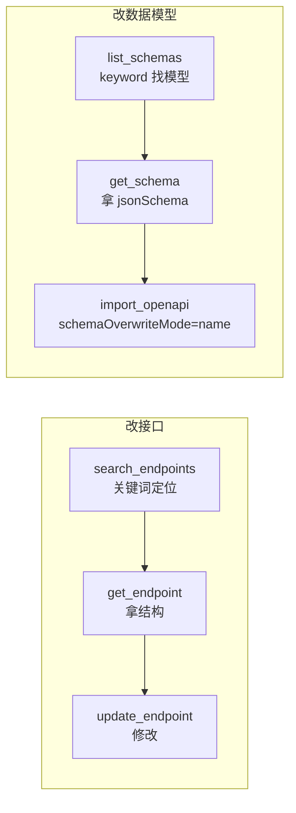

# Apifox MCP Server

[](https://github.com/lingpfeng1-ux/apifox-mcp-server/actions/workflows/ci.yml)
[](https://opensource.org/licenses/MIT)


**简体中文** | [English](./README.en.md)

一个用于 Apifox API 管理的 Model Context Protocol (MCP) 服务,支持多项目切换、接口/数据模型的读写与导入导出。专为 AI（Claude / Codex 等）高效操作 Apifox 而设计。

> v2.0 是一次完整重构:分层架构、修复对 personal token 失效的端点、补齐删除能力、新增检索工具与测试套件。工具集做了破坏性调整(详见下方[迁移说明](#从-v1-迁移破坏性变更))。

## 特性

- **多项目切换**:每个工具都支持可选 `projectId`,运行时切换项目,无需重启。
- **上下文友好**:列表/检索类工具只返回精简索引(不含大字段),需要完整结构再用对应 `get_*` 工具——实测 `list_schemas` 从近 100KB 降到几百字符。
- **不静默失败**:底层 HTTP 客户端识别 302 重定向与空响应,把"对当前 token 不可用的端点"抛成明确错误,杜绝"假成功"。
- **完整 CRUD**:接口增删改查、数据模型读/建/改/删、目录管理、OpenAPI 导入导出。

## 工具清单(共 18 个)

所有工具均支持可选 `projectId` 参数覆盖默认项目。

### 读 / 检索
| 工具 | 说明 |
|---|---|
| `apifox_get_project` | 项目详情 |
| `apifox_list_modules` | 模块列表 |
| `apifox_list_folders` | 列出模块下目录(moduleId/folderId/folderName/folderPath) |
| `apifox_find_folder` | 按模块名 + 目录名定位 folderId |
| `apifox_list_endpoints` | 接口索引列表(精简:id/name/method/path/folderId) |
| `apifox_search_endpoints` | 按 keyword/method/folderId 检索接口(精简索引) |
| `apifox_get_endpoint` | 接口详情(默认精简字段,`raw=true` 拿全量) |
| `apifox_list_schemas` | 数据模型索引(精简,支持 keyword 过滤) |
| `apifox_get_schema` | 单个数据模型完整 jsonSchema(按 id 或名称) |

### 写 / 删除
| 工具 | 说明 |
|---|---|
| `apifox_create_endpoint` | 创建接口(带成功校验;支持 parameters/requestBody/responses) |
| `apifox_update_endpoint` | 更新接口 |
| `apifox_delete_endpoint` | 删除接口(可选 `verify` 删除后回查) |
| `apifox_delete_schema` | 删除数据模型 |
| `apifox_delete_folder` | 删除接口目录 |

### 导入 / 导出
| 工具 | 说明 |
|---|---|
| `apifox_import_openapi` | 导入 OpenAPI/Swagger;含 `components.schemas` 时创建/覆盖数据模型 |
| `apifox_export_openapi` | 导出项目/模块为 OpenAPI(可按 moduleId、可选目录转 tag) |

## 快速开始

### 1. 获取 Access Token
登录 Apifox → 头像 → 账号设置 → API 访问令牌 → 新建并保存。

### 2. 安装构建
```bash
git clone https://github.com/lingpfeng1-ux/apifox-mcp-server.git
cd apifox-mcp-server
npm install
npm run build
```

### 3. 配置 MCP 客户端
```jsonc
{
  "mcpServers": {
    "Apifox": {
      "command": "node",
      "args": [
        "/绝对路径/apifox-mcp-server/dist/index.js",
        "--project=YOUR_PROJECT_ID"     // 可选
      ],
      "env": {
        "APIFOX_ACCESS_TOKEN": "YOUR_ACCESS_TOKEN"
      }
    }
  }
}
```

启动参数(均可选):
- `--project=<id>` 默认项目 ID
- `--base-url=<url>` API 基址(默认 `https://api.apifox.com`)
- `--api-version=<version>` 接口版本头(默认 `2024-03-28`)

## 推荐工作流(给 AI 高效使用)

设计为「**索引 → 详情 → 修改**」三段式,用最少上下文精准定位并改动:



- **改某个接口**:`search_endpoints`(关键词找到 apiId)→ `get_endpoint`(拿结构)→ `update_endpoint`
- **改某个数据模型字段**:`list_schemas`(keyword 找模型)→ `get_schema`(拿 jsonSchema)→ 修改 → `import_openapi`(`schemaOverwriteMode:"name"`)
- 列表类工具只给索引,不要直接把全量详情灌进上下文

## 多项目支持

每个工具都接受可选 `projectId`,解析优先级:

1. 工具调用参数里的 `projectId`(最高)
2. 启动参数 `--project=<id>`
3. 环境变量 `APIFOX_PROJECT_ID`
4. 以上都没有 → 返回明确错误

```jsonc
apifox_get_project({})                          // 默认项目
apifox_list_modules({ projectId: 7834388 })     // 覆盖到指定项目
apifox_find_folder({ projectId: 7834388, moduleName: "KAZ-PDP -接口", folderName: "Client-Image" })
// => { projectId:"7834388", moduleId:7586044, folderId:83801899, ... }
```

## 接口的参数 / 请求体 / 响应

`create_endpoint` / `update_endpoint` 支持 `parameters` / `requestBody` / `responses`,原样透传给 Apifox。改复杂结构时建议**先 `get_endpoint` 拿现有结构,改完整体传回**,避免字段格式出错。

`parameters` 形如 `{ path:[], query:[], header:[], cookie:[] }`,每个参数含 `name/required/enable/type/schema` 等字段。

> 若 `requestBody`/`responses` 里出现 `$ref` 引用数据模型,改字段应改**模型本身**(见下),而不是把 `$ref` 改成内联结构。

## 数据模型(data schema)工作流

| 操作 | 方式 |
|---|---|
| 读列表 | `list_schemas`(精简索引,支持 keyword) |
| 读单个 | `get_schema`(完整 jsonSchema) |
| 创建 | `import_openapi`,在 `components.schemas` 定义、`paths` 用 `$ref` 引用 |
| 改字段 | `import_openapi` 重导同名模型 + `schemaOverwriteMode:"name"`(默认 `ignore` 不覆盖) |
| 删除 | `delete_schema` |

```jsonc
// 创建带数据模型的接口
apifox_import_openapi({
  spec: JSON.stringify({
    openapi: "3.0.1",
    info: { title: "x", version: "1.0.0" },
    paths: {
      "/user/create": {
        post: {
          tags: ["User"],
          requestBody: { content: { "application/json": { schema: { $ref: "#/components/schemas/UserReq" } } } },
          responses: { "200": { content: { "application/json": { schema: { $ref: "#/components/schemas/UserResp" } } } } }
        }
      }
    },
    components: {
      schemas: {
        UserReq: { type: "object", properties: { name: { type: "string" } } },
        UserResp: { type: "object", properties: { id: { type: "integer" } } }
      }
    }
  })
})
```

> `schemaOverwriteMode` 可选值:`ignore`(默认) / `name` / `nameAndFolder` / `merge`;
> `apiOverwriteMode` 可选值:`ignore`(默认) / `methodAndPath` / `methodAndPathAndFolder` / `merge`。

## 实现说明 / 已知限制

本服务用 Apifox 个人访问令牌(`afxp_`)调用其 REST API。token 对部分端点有权限边界,本服务据此做了适配:

- **目录**:原生目录树端点不可用,`list_folders`/`find_folder` 通过 `export-openapi` + `http-apis` 关联重建;建目录通过 `import_openapi`(带 tag 的接口导入时自动建目录);删目录用 `delete_folder`。
- **数据模型**:`data-schemas` 写端点对 token 返回 302,因此创建/改字段统一走 `import_openapi`;删除走全局端点 `DELETE /api/v1/api-schemas/{id}`(带 `X-Project-Id`)。
- **失效端点不静默**:302 / 空响应会被识别为"端点不可用"并抛明确错误。

> 详细的端点可用性矩阵与实现原理见 [`docs/功能与实现方案.md`](./docs/功能与实现方案.md)。

## 测试

```bash
npm test                 # 单元测试(mock HTTP,无副作用)
npm run test:integration # opt-in 集成 smoke(真实 API,需环境变量)
```

集成 smoke 默认 skip,有副作用步骤(create/update/delete)再受 `APIFOX_RUN_WRITE` 二次开关控制:

```bash
APIFOX_RUN_INTEGRATION=1 \
APIFOX_RUN_WRITE=1 \
APIFOX_ACCESS_TOKEN=<token> \
APIFOX_TEST_PROJECT_ID=<projectId> \
APIFOX_TEST_MODULE_ID=<moduleId> \
npm run test:integration
```

## 架构

```
src/
  index.ts            入口:启动 MCP server、注册 handler、统一错误包装
  config.ts           配置解析(token / 默认 projectId / baseURL / api 版本)
  errors.ts           统一错误类型 ApifoxError
  apifox/
    http.ts           底层 HTTP:鉴权、302/空 body 识别、错误归一化、resolveProjectId
    projects.ts       项目 / 模块能力
    endpoints.ts      接口 CRUD + 检索(精简返回)
    folders.ts        目录能力(export + http-apis 关联重建 + 删除)
    schemas.ts        数据模型(读/取详情/删除)
    importExport.ts   import-data 导入 / export-openapi 导出
    types.ts          类型定义
    index.ts          能力层门面 Apifox
  tools/
    registry.ts       MCP 工具注册表(schema + handler)
__tests__/            vitest 单元测试 + opt-in 集成 smoke
docs/                 设计与实现文档
```

## 从 v1 迁移(破坏性变更)

| v1 工具 | v2 | 说明 |
|---|---|---|
| `apifox_get_modules` | `apifox_list_modules` | 重命名 |
| `apifox_get_endpoints` | `apifox_list_endpoints` | 重命名 + 改为精简索引 |
| `apifox_get_folders` | `apifox_list_folders` | 重命名 + 重写(原实现失效) |
| `apifox_create_folder` | (移除) | 改用 `import_openapi` 建目录 |
| `apifox_get_schemas` | `apifox_list_schemas` + `apifox_get_schema` | 拆为索引 + 详情 |
| `apifox_create_schema` | (移除) | 改用 `import_openapi` 创建模型 |

新增:`apifox_search_endpoints`、`apifox_get_schema`、`apifox_delete_schema`、`apifox_delete_folder`。

## 贡献

欢迎提 PR。开发与提交规范见 [CONTRIBUTING.md](./CONTRIBUTING.md)。

## License

MIT License — 见 [LICENSE](LICENSE)。
